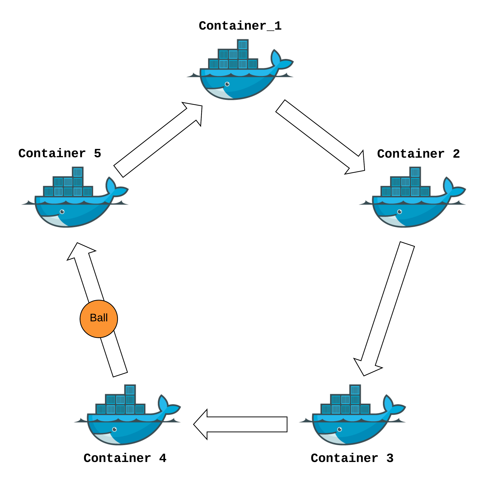

# ContainersJugglers

Creates **n** docker containers with ansible and sends file ball.yaml from one to another.

## To run the project:

### Run this command from project root

`ansible-playbook run_all.yaml -e "jugglers_number=5" -v`

### Console for running and controlling the process:

http://localhost:5001/docs

* Start process with `start_juggle` endpoint
* Stop process with `stop_juggle` endpoint
* Use `do_i_have_a_ball` endpoint to check count of ball moves from one container to another
* In the beginning **container_1** has the ball with counter = 0.
* Juggling stops when you run `stop_juggle` endpoint and ball arrives to the container from which you ran this endpoint.